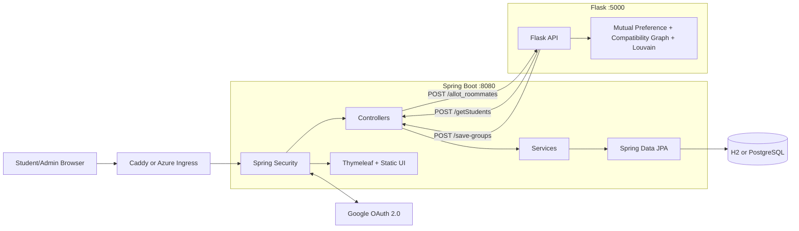
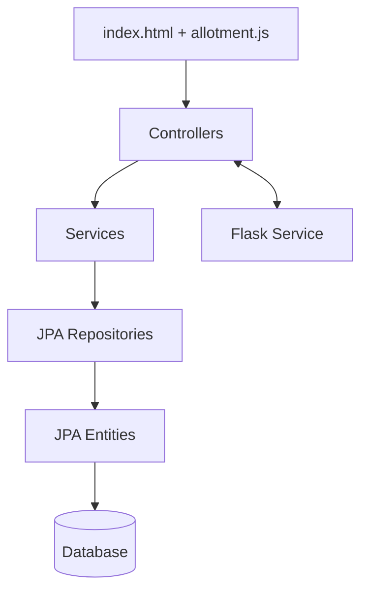
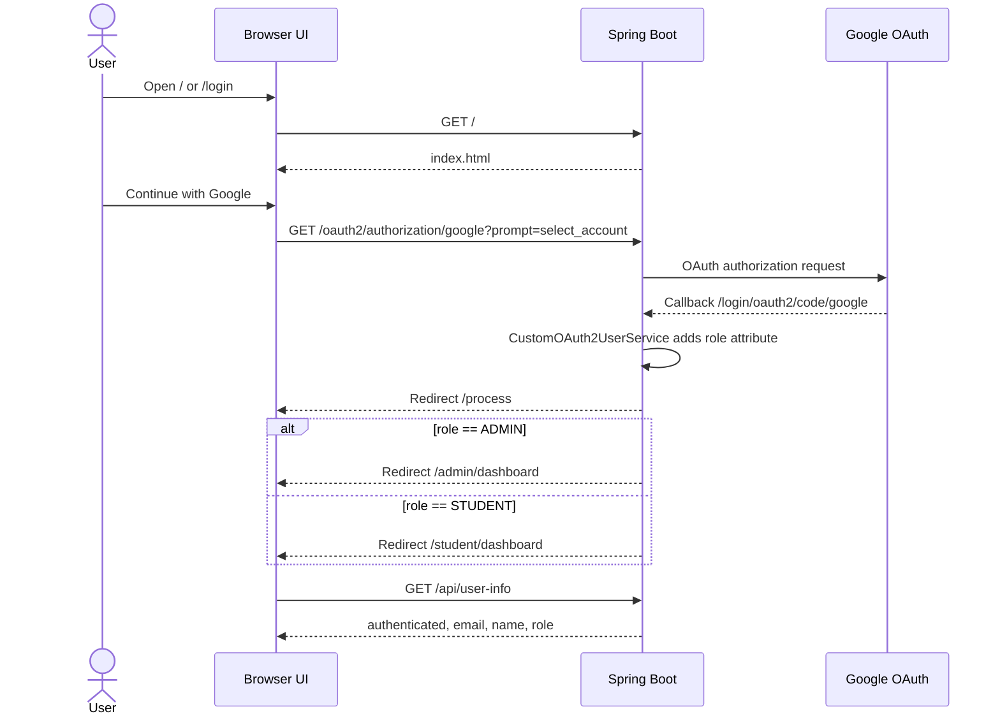
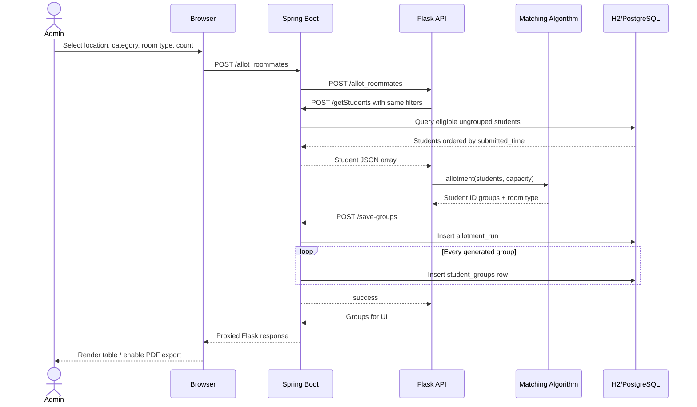
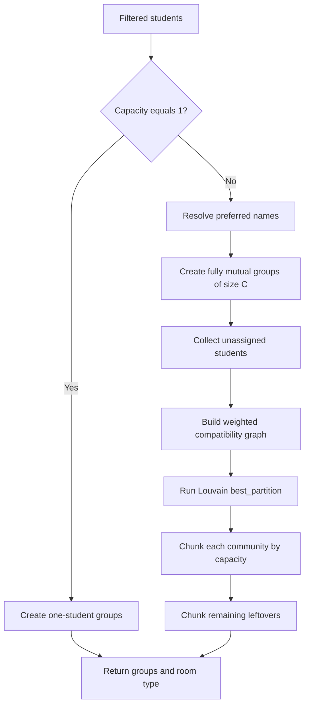
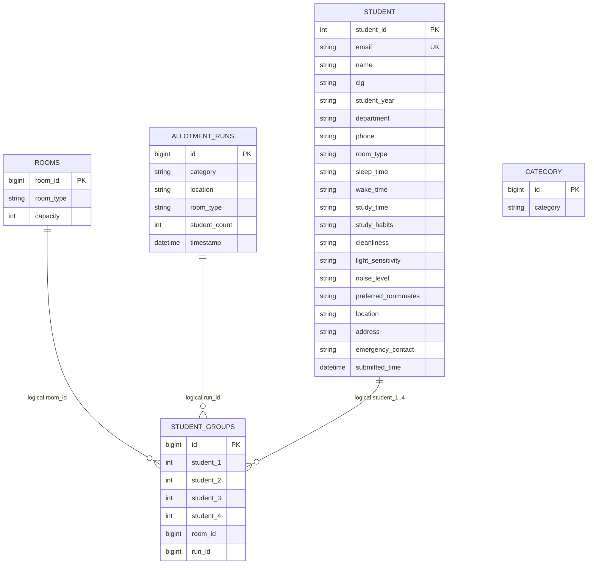
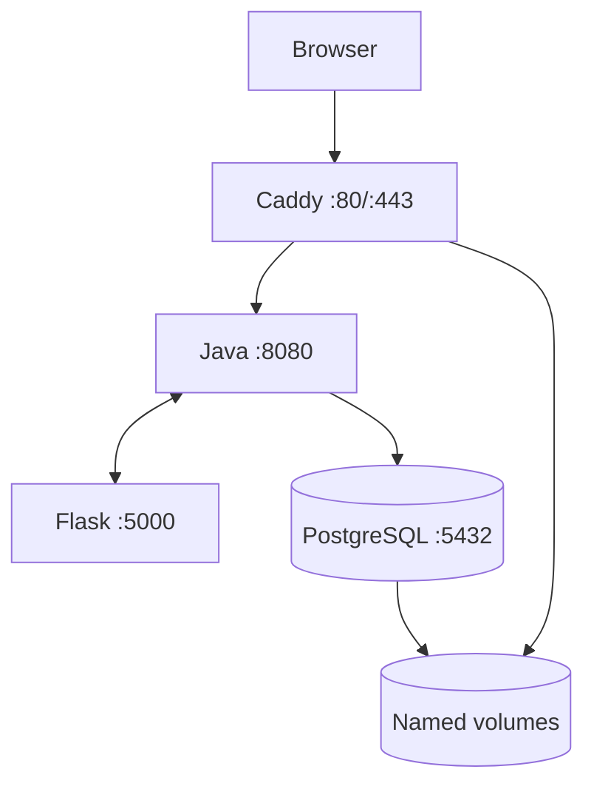

# StableRoomie

StableRoomie is a web-based hostel roommate recommendation and allotment system. Students authenticate with Google, submit lifestyle and room preferences, and view their final roommates. Administrators manage allotment categories and room types, inspect submissions, run the matching process, review historical runs, and export allotment results.

The application uses a Spring Boot web application as its main entry point, a Flask microservice for graph-based roommate matching, and an H2 or PostgreSQL database for persistence.

> **Placement-preparation note:** This document describes the repository as it currently works, including implementation limitations. The matching success path currently contains a known Flask bug documented in [Known Issues and Technical Debt](#known-issues-and-technical-debt).

## Table of Contents

- [1. Problem Statement](#1-problem-statement)
- [2. Features and Actors](#2-features-and-actors)
- [3. Technology Stack](#3-technology-stack)
- [4. Repository Structure](#4-repository-structure)
- [5. System Architecture](#5-system-architecture)
- [6. Spring Boot Architecture](#6-spring-boot-architecture)
- [7. Complete Application Flow](#7-complete-application-flow)
- [8. Matching Algorithm](#8-matching-algorithm)
- [9. Database Design](#9-database-design)
- [10. API Reference](#10-api-reference)
- [11. Authentication and Authorization](#11-authentication-and-authorization)
- [12. Frontend Working](#12-frontend-working)
- [13. Configuration](#13-configuration)
- [14. Running Locally](#14-running-locally)
- [15. Docker Architecture](#15-docker-architecture)
- [16. Azure Deployment](#16-azure-deployment)
- [17. Error Handling and Edge Cases](#17-error-handling-and-edge-cases)
- [18. Testing and Verification](#18-testing-and-verification)
- [19. Known Issues and Technical Debt](#19-known-issues-and-technical-debt)
- [20. Placement and Interview Preparation](#20-placement-and-interview-preparation)
- [21. Improvement Roadmap](#21-improvement-roadmap)
- [22. Source Map](#22-source-map)

## 1. Problem Statement

Manual hostel-room allocation does not naturally account for lifestyle compatibility. StableRoomie collects preferences such as sleeping time, waking time, cleanliness, study habits, noise tolerance, light sensitivity, location, preferred roommates, and room-sharing type. It then models students as a weighted graph and uses mutual preferences plus Louvain community detection to produce groups.

### Core goals

1. Authenticate students and administrators using Google OAuth 2.0.
2. Collect one preference profile per OAuth email.
3. Filter eligible students by category, location, room type, and requested count.
4. Exclude students who already appear in a persisted group.
5. Honor fully mutual roommate choices before algorithmic grouping.
6. Group remaining students using weighted compatibility edges.
7. Persist each allotment run and its generated groups.
8. Let students view their assigned room and roommate contact information.
9. Let administrators inspect students, statistics, run history, and downloadable results.

## 2. Features and Actors

### Student

- Google sign-in.
- Preference profile creation and update.
- Profile prefill on later visits.
- Preference locking after the student appears in a group.
- Current allotment status.
- Assigned room type and room identifier.
- Roommate name, email, phone, department, and year.

### Administrator

- Separate admin dashboard chosen from a hard-coded email mapping.
- Overview statistics for allotted and unallotted students.
- Student preference search and inspection.
- Category creation, listing, and deletion.
- Room-type creation, listing, and deletion.
- Filtered allotment execution.
- Allotment history and per-run group inspection.
- Client-side PDF export using jsPDF and AutoTable.

### Internal Flask service

- Health endpoints.
- Student retrieval from Spring Boot.
- Compatibility calculation.
- Mutual-preference grouping.
- Louvain community detection.
- Group persistence callback to Spring Boot.

## 3. Technology Stack

| Area | Technology | Repository evidence |
|---|---|---|
| Main backend | Java 17, Spring Boot 3.5.0 | [`pom.xml`](StableRoomie/pom.xml) |
| Web/API | Spring MVC | `spring-boot-starter-web` |
| Persistence | Spring Data JPA, Hibernate | `spring-boot-starter-data-jpa` |
| Security | Spring Security, OAuth2 Client | `spring-boot-starter-security`, `spring-boot-starter-oauth2-client` |
| Server-rendered view | Thymeleaf | `spring-boot-starter-thymeleaf` |
| Frontend | HTML, CSS, vanilla JavaScript | [`index.html`](StableRoomie/src/main/resources/templates/index.html), [`allotment.js`](StableRoomie/src/main/resources/static/scripts/allotment.js) |
| Matching service | Python 3.10 image, Flask 3.1.1 | [`flask-api/Dockerfile`](flask-api/Dockerfile), [`requirements.txt`](flask-api/requirements.txt) |
| Graph processing | NetworkX 3.2.1, python-louvain 0.16 | [`allot.py`](flask-api/service/allot.py) |
| HTTP between services | Spring `RestTemplate`, Python `requests` | Java group controller and Flask app |
| Development DB | File-backed H2 in PostgreSQL compatibility mode | [`application.properties`](StableRoomie/src/main/resources/application.properties) |
| Container DB | PostgreSQL 14 Alpine | [`docker-compose.yml`](docker-compose.yml) |
| Packaging | Maven, JAR, Gunicorn | Java and Flask Dockerfiles |
| Local reverse proxy | Caddy 2 | [`Caddyfile`](Caddyfile) |
| Cloud target | Azure Container Apps and Azure Container Registry | [`deploy-azure.sh`](deploy/deploy-azure.sh) |

Although NumPy, SciPy, scikit-learn, Joblib, and Threadpoolctl are listed in `requirements.txt`, the active matching implementation does not import or train a scikit-learn model. It is a deterministic weighted-graph algorithm.

## 4. Repository Structure

```text
StableRoomie/
├── readme.md                         # This complete project guide
├── docker-compose.yml                # PostgreSQL, Java, Flask, Caddy
├── Caddyfile                         # Reverse proxy to Java backend
├── students_seed.sql                 # Optional 500-row manual seed script
├── AZURE_DEPLOYMENT.md               # Azure command guide
├── DEPLOYMENT_SUMMARY.md             # Recorded deployment summary
├── RUNNING.md                        # Older local-running notes
├── deploy/
│   ├── deploy-azure.sh               # Build/push/deploy automation
│   ├── check-activity.sh             # Container activity helper
│   └── azure-cost-manager.sh         # Scale/status helpers
├── StableRoomie/                     # Spring Boot application
│   ├── pom.xml
│   ├── Dockerfile
│   ├── Dockerfile.deploy
│   └── src/main/
│       ├── java/in/edu/ssn/hostel/
│       │   ├── HostelAllotmentApplication.java
│       │   ├── config/               # Spring Security
│       │   ├── controller/           # MVC and REST entry points
│       │   ├── service/              # Business logic
│       │   ├── repo/                 # JPA repositories
│       │   └── model/                # Entities and filter DTO
│       └── resources/
│           ├── application.properties
│           ├── import.sql            # Currently contains no seed statements
│           ├── templates/index.html  # Single-page login/admin/student UI
│           └── static/               # CSS, JavaScript, image
└── flask-api/
    ├── app.py                        # Active Flask application
    ├── app_temp.py                   # Legacy development variant
    ├── requirements.txt
    ├── Dockerfile
    ├── Dockerfile.deploy
    ├── model/students.py             # Unused legacy model
    └── service/allot.py              # Matching algorithm
```

Generated directories such as `target/`, Python virtual environments, and runtime logs are not application source.

## 5. System Architecture

### 5.1 Component architecture



### 5.2 Network and port map

| Component | Local/container port | Responsibility |
|---|---:|---|
| Caddy | 80, 443 | TLS termination and reverse proxy in Docker Compose |
| Spring Boot | 8080 | UI, OAuth session, REST APIs, persistence orchestration |
| Flask/Gunicorn | 5000 | Recommendation and grouping engine |
| PostgreSQL | 5432 | Persistent application data in Compose |

The browser communicates only with Spring Boot. The browser does not call Flask directly in the normal application flow.

### 5.3 Why two backend services?

Spring Boot owns identity, HTTP sessions, UI delivery, validation/orchestration, and relational persistence. Flask isolates the graph algorithm and Python graph libraries. This is a polyglot microservice-style split, although both services form one application and call one another synchronously.

### 5.4 Inter-service dependency

The services have a circular runtime call chain during allotment:

```text
Browser -> Spring Boot -> Flask -> Spring Boot -> Flask algorithm
        -> Spring Boot persistence -> Flask -> Spring Boot -> Browser
```

This works because `/getStudents` and `/save-groups` are reachable by Flask, but they are currently public rather than protected by service authentication.

## 6. Spring Boot Architecture

### 6.1 Layered design



| Layer | Main classes | Responsibility |
|---|---|---|
| Application | `HostelAllotmentApplication` | Bootstraps component scanning and Spring Boot |
| Configuration | `SecurityConfig` | Route protection, OAuth login, logout, `RestTemplate` bean |
| Controllers | `LoginController`, `DashboardController`, `StudentController`, `roomsController`, `categoryController`, `groupsController` | HTTP request/response handling |
| Services | `studentService`, `roomService`, `categoryService`, `GroupService`, `CustomOAuth2UserService` | Filtering, persistence workflows, default data, OAuth role attribute |
| Repositories | `studentRepo`, `roomRepo`, `groupsRepo`, `categoryRepo`, `allotmentRunRepo` | CRUD and custom JPQL queries |
| Models | `Student`, `Rooms`, `Groups`, `Category`, `AllotmentRun`, `filter` | Database entities and request DTO |
| View | `index.html`, `styles.css`, `allotment.js` | Single-page dashboard and interactions |

### 6.2 Startup sequence

1. `HostelAllotmentApplication.main()` starts Spring Boot.
2. `application.properties` resolves database and OAuth environment variables.
3. Hibernate updates the schema because `spring.jpa.hibernate.ddl-auto=update`.
4. Spring creates repositories, services, controllers, the security chain, and `RestTemplate`.
5. `roomService.initDefaultRooms()` inserts `3-Sharing` and `2-Sharing` when the rooms table is empty.
6. `categoryService.initDefaultCategories()` inserts six SSN department/year categories when the category table is empty.
7. The embedded server listens on port 8080.

Lazy initialization is enabled, so some bean initialization may be deferred until first use.

## 7. Complete Application Flow

### 7.1 Google login and role routing



Role assignment is not database-driven. Two email addresses in `CustomOAuth2UserService` receive `ADMIN`; every other Google user with an email receives `STUDENT`.

### 7.2 Student preference submission

1. The authenticated student opens `/student/dashboard`.
2. JavaScript calls `/api/student/profile` and `/api/student/allotment`.
3. If a profile exists, the form is populated with persisted values.
4. The student submits name, student ID, college, department, year, contact details, lifestyle preferences, location, preferred roommates, room type, and an ISO timestamp.
5. JavaScript sends `POST /saveStudents`.
6. `StudentController` overwrites the request email with the authenticated OAuth email.
7. The controller checks whether the submitted student ID already appears in any group slot.
8. If grouped, it returns HTTP 400 and the preferences remain locked.
9. Otherwise, `studentService` calls `studentRepo.save()`. Because the student ID is the primary key, this inserts a new row or updates the existing row with that ID.
10. The saved `Student` entity is returned as JSON.

### 7.3 Student allotment lookup

1. The UI calls `GET /api/student/allotment`.
2. The backend finds the student by OAuth email.
3. If no profile exists, it returns `allotted: false` and asks the user to complete the profile.
4. The groups repository searches all four student columns for the student ID.
5. If no group exists, it returns `allotted: false`.
6. If a group exists, the backend loads its room type and each other student record.
7. It returns room details and selected roommate contact/profile fields.

### 7.4 Administrator setup flow

1. The admin dashboard loads `/get-category`, `/get-rooms`, `/api/admin/students`, `/api/admin/allotments`, and `/api/admin/allotment-stats` as needed.
2. A category is sent to `POST /save-category` as a JSON string, not as an object.
3. A room type is sent to `POST /room-details` as `{ "name": "...", "capacity": number }`.
4. Delete actions call category or room delete endpoints.
5. Student rows can be searched and inspected in a modal.

### 7.5 End-to-end allotment flow



### 7.6 Eligibility filtering

`studentService.getStudents()` performs these transformations and filters:

1. Requires category format `college-department-year`.
2. Maps category prefix `ssn` to `SSN College`; any other prefix maps to `Shiv Nadar University`.
3. Uppercases the department segment.
4. Parses `numStudents`; invalid or absent input defaults to 100.
5. Uses a first-page `PageRequest` with the requested count.
6. If location is `both`, ignores location; otherwise, matches location case-insensitively.
7. Matches the normalized category and room type.
8. Excludes every student ID present in `student_1`, `student_2`, `student_3`, or `student_4` of any group.
9. Orders eligible students by `submittedTime` ascending.

### 7.7 Group persistence

`GroupService.saveGroups()`:

1. Reads generated groups and the room type from the Flask payload.
2. Finds a room ID for the room type or creates a room record if none exists.
3. Counts every populated student slot.
4. Creates an `allotment_runs` row containing category, location, room type, count, and current timestamp.
5. Creates one `student_groups` row per generated group with up to four student IDs.
6. Assigns the same selected room ID and new run ID to every group in that run.

The same room ID assignment is a current modeling limitation; see [Known Issues and Technical Debt](#19-known-issues-and-technical-debt).

## 8. Matching Algorithm

The algorithm is implemented in [`flask-api/service/allot.py`](flask-api/service/allot.py).

### 8.1 Inputs and outputs

**Input:** a filtered array of student JSON objects and a room capacity.

**Output:** a list of groups, where each group is a list of student IDs, plus the room type read from the first student.

### 8.2 Compatibility score

For every pair of unassigned students, the algorithm adds these contributions:

| Factor | Rule | Maximum contribution |
|---|---|---:|
| Sleep time | Linear decrease to zero across a two-hour difference | 0.4 |
| Wake time | Linear decrease to zero across a two-hour difference | 0.4 |
| Noise level | Exact match | 0.3 |
| Light sensitivity | Exact match | 0.3 |
| Cleanliness | Exact match: 0.3; either `moderately-clean`: 0.2 | 0.3 |
| Study habit | Exact match: 0.3; predefined mixed pairs: 0.0-0.2 | 0.3 |
| Preferred roommate | Mutual: 1.0; one-way: 0.5 | 1.0 |
| **Maximum implemented pair score** | All maximum rules satisfied | **3.0** |

Sleep times after midnight are linearized so that `12:00 AM` becomes 24, `1:00 AM` becomes 25, and so on. Invalid sleep time defaults to 10 PM; invalid wake time defaults to 7 AM.

Preferred roommates are stored as comma-separated names. The code resolves those names to student IDs; duplicate names can therefore make preference resolution ambiguous.

### 8.3 Two-pass grouping

#### Pass 1: fully mutual requested groups

For room capacity `C`:

1. Visit each unassigned student.
2. Resolve the student's preferred-roommate names to IDs.
3. Generate combinations of `C - 1` preferred students.
4. For each candidate group of size `C`, verify that every member lists every other member.
5. Immediately accept the first fully mutual group and mark its members assigned.

This gives explicit, reciprocal choices priority over calculated compatibility.

#### Pass 2: Louvain communities

1. Add every remaining student as a graph node.
2. Calculate compatibility for every remaining pair.
3. Add a weighted edge only when the score is greater than zero.
4. Run `community_louvain.best_partition()` using edge weight.
5. Split each discovered community into chunks of room capacity.
6. Collect all still-unassigned students and chunk them sequentially, allowing the final group to be smaller than capacity.

### 8.4 Algorithm flow



### 8.5 Complexity discussion

- Compatibility graph construction compares every remaining pair, so it is quadratic in the number of unassigned students: `O(n^2)` pair calculations.
- Mutual-preference grouping can generate combinations of preferred students, so its cost grows with preference-list size and room capacity.
- Memory is up to `O(n^2)` for a dense compatibility graph.
- Louvain is used because it groups strongly connected students according to total edge weight, but final fixed-size room chunks are taken from community member order rather than optimized again within each community.

## 9. Database Design

### 9.1 Persistence behavior

- Hibernate manages schema creation/update with `ddl-auto=update`.
- There is no Flyway or Liquibase migration history.
- Development defaults to a file-backed H2 database.
- Docker Compose uses PostgreSQL 14.
- `students_seed.sql` is optional manual seed data and is not mounted or automatically executed by Compose.
- `import.sql` currently contains no executable seed data.

### 9.2 Entity relationship diagram

The arrows below represent logical ID references in application code. The entities do **not** declare JPA relationships or database foreign-key annotations.



### 9.3 Table definitions

#### `student`

| Column | Java type | Constraint/meaning |
|---|---|---|
| `student_id` | `int` | Primary key; supplied by client, not generated |
| `email` | `String` | Unique; replaced by authenticated OAuth email on save |
| `name` | `String` | Student name |
| `clg` | `String` | College display value |
| `student_year` | `String` | Academic year |
| `department` | `String` | Department code |
| `phone` | `String` | Contact number |
| `room_type` | `String` | Preferred sharing type |
| `sleep_time` | `String` | Lifestyle input used by matcher |
| `wake_time` | `String` | Lifestyle input used by matcher |
| `study_time` | `String` | Stored preference; not used in current compatibility score |
| `study_habits` | `String` | Used by matcher |
| `cleanliness` | `String` | Used by matcher |
| `light_sensitivity` | `String` | Used by matcher |
| `noise_level` | `String` | Used by matcher |
| `preferred_roommates` | `String` | Comma-separated names |
| `location` | `String` | Chennai/non-Chennai filtering value |
| `address` | `String` | Student address |
| `emergency_contact` | `String` | Emergency phone/contact |
| `submitted_time` | `LocalDateTime` | Used for first-submitted-first-selected ordering |

#### `rooms`

| Column | Java type | Constraint/meaning |
|---|---|---|
| `room_id` | `Long` | Identity primary key |
| `room_type` | `String` | Display name such as `3-Sharing` |
| `capacity` | `Integer` | Group size requested by UI; not enforced during persistence |

#### `student_groups`

| Column | Java type | Constraint/meaning |
|---|---|---|
| `id` | `Long` | Sequence-generated primary key using `student_sequence` |
| `student_1` | `Integer` | Nullable logical student reference |
| `student_2` | `Integer` | Nullable logical student reference |
| `student_3` | `Integer` | Nullable logical student reference |
| `student_4` | `Integer` | Nullable logical student reference |
| `room_id` | `Long` | Logical room reference; no JPA relationship |
| `run_id` | `Long` | Nullable logical allotment-run reference |

#### `allotment_runs`

| Column | Java type | Constraint/meaning |
|---|---|---|
| `id` | `Long` | Identity primary key |
| `category` | `String` | Filter category used for the run |
| `location` | `String` | Filter location used for the run |
| `room_type` | `String` | Room type returned by matcher |
| `student_count` | `Integer` | Total populated student slots |
| `timestamp` | `LocalDateTime` | Persistence time of the run |

#### `category`

| Column | Java type | Constraint/meaning |
|---|---|---|
| `id` | `Long` | Sequence-generated primary key using `category_seq` |
| `category` | `String` | Value expected in `college-department-year` form |

### 9.4 Default data

On an empty database, application services attempt to create:

```text
Rooms:      3-Sharing (capacity 3), 2-Sharing (capacity 2)
Categories: ssn-CSE-1st, ssn-CSE-2nd, ssn-ECE-1st,
            ssn-ECE-2nd, ssn-IT-1st, ssn-IT-2nd
```

### 9.5 Data-integrity implications

Because group references are plain numeric columns:

- The database does not prevent a nonexistent student, room, or run ID.
- A student can technically appear in multiple groups.
- Deleting a room can leave group rows referring to the removed room.
- Four student columns impose a hard maximum of four persisted members per group.
- Repository methods returning one `Optional` can fail if several rows match.

A normalized design would introduce a `group_members` join table with foreign keys and a unique constraint on active student allotment.

## 10. API Reference

### 10.1 Authentication legend

- **Public:** permitted by the current Spring Security configuration.
- **Authenticated:** any logged-in Google user; current API security does not enforce admin role.
- **Manual role check:** controller checks the OAuth `role` attribute.
- **Flask:** no authentication in the Flask service itself.

### 10.2 Page, session, and identity endpoints

| Method | Path | Access | Input | Success result |
|---|---|---|---|---|
| `GET` | `/` | Public | None | Renders `index.html` |
| `GET` | `/login` | Public | Optional query error | Renders `index.html` |
| `GET` | `/error` | Public | None | Redirects to `/login?error=oauth` |
| Any | `/process` | Authenticated | OAuth principal | Redirects by role |
| `GET` | `/api/user-info` | Public | Current session if present | Authentication state and user attributes |
| `GET` | `/logout` | Authenticated in normal use | Session/cookies | Invalidates session, clears cookies, redirects `/` |
| `GET` | `/admin/dashboard` | Manual ADMIN check | OAuth principal | Renders `index.html` or redirects to login |
| `GET` | `/student/dashboard` | Manual STUDENT check | OAuth principal | Renders `index.html` or redirects to login |

Spring Security also provides `/oauth2/authorization/google` and handles `/login/oauth2/code/google`.

#### `GET /api/user-info`

Unauthenticated response:

```json
{
  "authenticated": false
}
```

Authenticated response shape:

```json
{
  "authenticated": true,
  "email": "student@ssn.edu.in",
  "name": "Student Name",
  "role": "STUDENT"
}
```

### 10.3 Student endpoints

| Method | Path | Access | Purpose |
|---|---|---|---|
| `POST` | `/saveStudents` | Authenticated | Insert/update preference profile |
| `GET` | `/api/student/profile` | Authenticated | Find profile by OAuth email |
| `POST` | `/getStudents` | Public | Internal filtered student lookup used by Flask |
| `GET` | `/api/student/allotment` | Authenticated | Current student's room and roommates |
| `GET` | `/api/admin/students` | Authenticated | Return all student entities |
| `GET` | `/api/admin/allotment-stats` | Authenticated | Allotted/unallotted counts and lists |

#### `POST /saveStudents`

Request shape:

```json
{
  "studentId": 1234,
  "name": "Student Name",
  "clg": "SSN College",
  "year": "2nd",
  "department": "IT",
  "phone": "9000000000",
  "roomType": "3-Sharing",
  "sleepTime": "11:00 PM",
  "wakeTime": "7:00 AM",
  "studyTime": "Evening",
  "studyHabits": "silent",
  "cleanliness": "moderately-clean",
  "lightSensitivity": "Low",
  "noiseLevel": "Low",
  "preferredRoommates": "Student Two, Student Three",
  "location": "chennai",
  "address": "Address",
  "emergencyContact": "9000000001",
  "submittedTime": "2026-08-18T12:30:00.000Z"
}
```

The server ignores any request `email` value and uses the OAuth principal email. Success returns the saved entity. If the student ID is already grouped, HTTP 400 returns:

```json
{
  "message": "Your preferences are locked because room allotment has already been finalized."
}
```

#### `POST /getStudents`

Request:

```json
{
  "location": "both",
  "category": "ssn-IT-2nd",
  "roomType": "3-Sharing",
  "numStudents": "60"
}
```

Success returns a JSON array of full `Student` entities. Invalid category form raises a server-side `IllegalArgumentException`; no controller exception mapper currently converts it to a structured client error.

#### `GET /api/student/allotment`

Not yet grouped:

```json
{
  "allotted": false
}
```

Grouped response shape:

```json
{
  "allotted": true,
  "roomId": 1,
  "roomType": "3-Sharing",
  "roommates": [
    {
      "name": "Roommate Name",
      "email": "roommate@ssn.edu.in",
      "phone": "9000000002",
      "department": "IT",
      "year": "2nd"
    }
  ]
}
```

#### `GET /api/admin/allotment-stats`

Response shape:

```json
{
  "allottedCount": 30,
  "unallottedCount": 10,
  "allottedStudents": [
    {
      "studentId": 1234,
      "name": "Student Name",
      "email": "student@ssn.edu.in",
      "phone": "9000000000",
      "category": "SSN College-IT-2nd",
      "location": "chennai",
      "roomDetails": "Room 1"
    }
  ],
  "unallottedStudents": []
}
```

### 10.4 Category endpoints

| Method | Path | Access | Input/result |
|---|---|---|---|
| `POST` | `/save-category` | Authenticated | Raw JSON string; returns saved category |
| `GET` | `/get-category` | Authenticated | Returns all category entities |
| `DELETE` | `/delete-category/{id}` | Authenticated | Deletes by ID; returns 200 with empty body |

The frontend sends the category as a JSON string:

```json
"ssn-IT-3rd"
```

Depending on message conversion, the persisted value may include quote characters because the controller accepts `String` directly rather than `{ "category": "..." }`.

### 10.5 Room endpoints

| Method | Path | Access | Input/result |
|---|---|---|---|
| `POST` | `/room-details` | Authenticated | `{ "name": "4-Sharing", "capacity": 4 }`; returns room |
| `GET` | `/get-rooms` | Authenticated | Returns all rooms |
| `DELETE` | `/remove-room/{id}` | Authenticated | Deletes one room by primary key |
| `DELETE` | `/remove-room-type/{roomType}` | Authenticated | Deletes every room with exact type |
| `POST` | `/remove-room-type` | Authenticated | Legacy form parameter; deletes and redirects |
| `POST` | `/edit-room-type` | Authenticated | Legacy no-op; redirects to admin dashboard |

### 10.6 Allotment and group endpoints

| Method | Path | Access | Purpose |
|---|---|---|---|
| `POST` | `/allot_roommates` | Authenticated | Proxy an allotment request to Flask |
| `POST` | `/save-groups` | Public | Internal Flask callback that persists a run/groups |
| `GET` | `/api/admin/allotments` | Authenticated | Return run history; may migrate legacy groups |
| `GET` | `/api/admin/allotment-run/{runId}/groups` | Authenticated | Return display-ready groups for one run |

#### `POST /allot_roommates` on Spring Boot

Request:

```json
{
  "location": "chennai",
  "category": "ssn-IT-2nd",
  "roomType": "3-Sharing",
  "numStudents": "30",
  "capacity": 3
}
```

Spring Boot forwards the body to Flask and passes the Flask status/body back to the browser.

Intended success response:

```json
{
  "message": "Allotment Successful",
  "roomType": "3-Sharing",
  "groups": [
    {
      "student_1": "Student One (1001)",
      "student_2": "Student Two (1002)",
      "student_3": "Student Three (1003)"
    }
  ]
}
```

#### `POST /save-groups`

Internal request shape:

```json
{
  "roomType": "3-Sharing",
  "category": "ssn-IT-2nd",
  "location": "chennai",
  "groups": [
    {
      "student_1": 1001,
      "student_2": 1002,
      "student_3": 1003
    }
  ]
}
```

Success body is plain text:

```text
success
```

#### `GET /api/admin/allotments`

Response shape:

```json
[
  {
    "id": 1,
    "category": "ssn-IT-2nd",
    "location": "chennai",
    "roomType": "3-Sharing",
    "studentCount": 30,
    "date": "2026-08-18 12:30:00"
  }
]
```

This GET has a side effect: groups with `run_id = null` are attached to a newly created `Legacy Category` run before history is returned.

### 10.7 Flask endpoints

| Method | Path | Access | Purpose/result |
|---|---|---|---|
| `GET` | `/` | Flask public | `{ "status": "ok" }` |
| `GET` | `/health` | Flask public | `{ "status": "ok" }` |
| `POST` | `/allot_roommates` | Flask public | Fetch, match, persist, and return groups |

Flask returns HTTP 400 for missing/empty student results, HTTP 500 when Java fetch/save fails or an algorithm exception occurs, and HTTP 200 on the intended success path.

## 11. Authentication and Authorization

### 11.1 Authentication mechanism

- Google OAuth 2.0 supplies email and profile attributes.
- Spring Security creates a server-side authenticated session using `JSESSIONID`.
- `CustomOAuth2UserService` wraps Google attributes and adds a custom `role` field.
- The granted Spring authority is always `ROLE_USER`; `ADMIN` and `STUDENT` exist only as an OAuth attribute.
- Dashboard controllers inspect that attribute manually.

### 11.2 Current route policy

Explicitly public Spring paths include:

```text
/
/login
/api/user-info
/error
/favicon.ico
/styles.css
/scripts/**
/src/**
/getStudents
/save-groups
```

Every other Spring path requires authentication, but admin APIs do not require an admin authority. Therefore, an authenticated student can call admin APIs directly even if the UI hides them.

### 11.3 Security observations

- CSRF is disabled globally despite cookie-based session authentication.
- Controller-level `@CrossOrigin` has no origin restriction.
- Flask enables unrestricted CORS and has no authentication.
- The declared `@ssn.edu.in` allowed-domain constant is not enforced.
- Full student entities, including personal contact data, can be returned by the public `/getStudents` endpoint.
- Admin identification is hard-coded rather than stored as a role/permission model.
- Secrets must remain environment variables and must never be committed.

For production, use role authorities, method/route authorization, CSRF protection, restricted CORS, service-to-service authentication, DTOs that omit private fields, and an enforced organization-domain policy.

## 12. Frontend Working

### 12.1 Rendering model

The application uses one Thymeleaf template, `index.html`, for login and both dashboards. JavaScript calls `/api/user-info`, determines the role, and shows the relevant sections. Navigation is implemented by hiding and showing DOM sections rather than using a client-side router.

### 12.2 Student form payload

`allotment.js` reads DOM values, creates the student JSON object, and sends it with `fetch()` to `/saveStudents`. It generates `submittedTime` using `new Date().toISOString()`.

### 12.3 Admin interactions

- Categories and rooms are fetched dynamically.
- Allotment requests are submitted asynchronously.
- Results are rendered into an HTML table.
- Statistics are built from `/api/admin/allotment-stats`.
- Allotment history is built from `/api/admin/allotments`.
- A run's groups are fetched only when its PDF is requested.
- jsPDF and AutoTable generate downloadable PDFs entirely in the browser.

### 12.4 Static resources

| URL | Resource |
|---|---|
| `/styles.css` | Main CSS |
| `/scripts/allotment.js` | All client behavior and API calls |
| `/src/ssn_logo.png` | Logo image |

## 13. Configuration

### 13.1 Spring Boot environment variables

| Variable | Required | Default | Meaning |
|---|---|---|---|
| `GOOGLE_CLIENT_ID` | Yes for OAuth | None | Google OAuth client ID |
| `GOOGLE_CLIENT_SECRET` | Yes for OAuth | None | Google OAuth client secret |
| `DB_URL` | No | `jdbc:h2:file:./data/stableromie;DB_CLOSE_ON_EXIT=FALSE;MODE=PostgreSQL` | JDBC connection URL |
| `DB_USERNAME` | No | `sa` | Database user |
| `DB_PASSWORD` | No | Empty | Database password |
| `DB_DRIVER` | No | `org.h2.Driver` | JDBC driver |
| `DB_DIALECT` | No | `org.hibernate.dialect.H2Dialect` | Hibernate dialect |
| `FLASK_API_URL` | No | `http://127.0.0.1:5000` in controller | Flask base URL |

### 13.2 Flask environment variables

| Variable | Required | Default | Meaning |
|---|---|---|---|
| `JAVA_BACKEND_URL` | No | `http://localhost:8080` | Spring Boot base URL used for callbacks |

### 13.3 Google OAuth redirect URI

For local development, configure:

```text
http://localhost:8080/login/oauth2/code/google
```

For deployment, configure the equivalent HTTPS callback on the deployed Java application domain.

## 14. Running Locally

### 14.1 Prerequisites

- Java 17.
- Maven compatible with the project.
- Python capable of installing the pinned dependencies.
- Google OAuth client credentials.
- Optional PostgreSQL 14; otherwise H2 is used.

### 14.2 Option A: Spring Boot with default H2 and Flask

Terminal 1:

```bash
cd StableRoomie
export GOOGLE_CLIENT_ID="your-client-id"
export GOOGLE_CLIENT_SECRET="your-client-secret"
export FLASK_API_URL="http://127.0.0.1:5000"
mvn spring-boot:run
```

Terminal 2:

```bash
cd flask-api
python3 -m venv venv
source venv/bin/activate
pip install -r requirements.txt
export JAVA_BACKEND_URL="http://localhost:8080"
python3 app.py
```

Open:

```text
http://localhost:8080
```

### 14.3 Option B: Local PostgreSQL

Create the `stableromie` database, then start Java with:

```bash
cd StableRoomie
export GOOGLE_CLIENT_ID="your-client-id"
export GOOGLE_CLIENT_SECRET="your-client-secret"
export DB_URL="jdbc:postgresql://localhost:5432/stableromie"
export DB_USERNAME="your-db-user"
export DB_PASSWORD="your-db-password"
export DB_DRIVER="org.postgresql.Driver"
export DB_DIALECT="org.hibernate.dialect.PostgreSQLDialect"
export FLASK_API_URL="http://127.0.0.1:5000"
mvn spring-boot:run
```

The current repository has recorded PostgreSQL sequence/schema failures for category initialization on an existing database. See troubleshooting and known issues before using that environment for a demonstration.

### 14.4 Optional sample students

`students_seed.sql` contains 500 student inserts with IDs 1000 through 1499. It is not automatic. Apply it manually only after Hibernate has created the `student` table and only in a disposable development database.

```bash
psql -d stableromie -f students_seed.sql
```

### 14.5 Basic health checks

```bash
curl http://localhost:5000/health
curl http://localhost:8080/api/user-info
```

Expected unauthenticated Java response:

```json
{"authenticated":false}
```

## 15. Docker Architecture

### 15.1 Compose services



`docker-compose.yml` starts:

1. PostgreSQL and waits for `pg_isready`.
2. Java after PostgreSQL is healthy.
3. Flask after Java is started.
4. Caddy after Java is started.

Only PostgreSQL has a Compose health check. `depends_on` for Java/Flask does not prove the HTTP service is ready.

### 15.2 Container build details

- Java uses a Maven 3.9.6/Eclipse Temurin 17 build stage and a Temurin 17 JRE runtime stage.
- Java packaging runs `mvn clean package -DskipTests`.
- Flask uses Python 3.10 slim and Gunicorn on port 5000 with a 120-second timeout.
- Caddy proxies `stableroomie.ssnce.dev` to `java-backend:8080` on the Compose network.

### 15.3 Compose startup

Provide OAuth values in the shell or an uncommitted environment file, then run:

```bash
export GOOGLE_CLIENT_ID="your-client-id"
export GOOGLE_CLIENT_SECRET="your-client-secret"
docker compose up --build
```

The Compose file contains a development database password. Replace it and use secret management before any real deployment.

## 16. Azure Deployment

The repository targets two Azure Container Apps in a shared Container Apps Environment:

- Java application on port 8080.
- Flask application on port 5000.
- Images stored in Azure Container Registry.
- PostgreSQL managed separately.
- External ingress and optional custom domain on the Java app.
- Scale range recorded as zero to three replicas.

### Required cloud configuration

Java needs database, OAuth, and Flask URL variables. Flask needs the Java URL. These should use valid Container Apps service addresses and managed secrets.

### Important script behavior

`deploy/deploy-azure.sh` builds and pushes both images, then creates or updates the Container Apps. It does **not** set the required runtime environment variables; it explicitly leaves that as a next step. `StableRoomie/Dockerfile.deploy` also copies an already-built JAR rather than building it, so `mvn package` must have produced `target/StableRoomie-1.0.0.jar` before that image build.

Use [`AZURE_DEPLOYMENT.md`](AZURE_DEPLOYMENT.md) as a reference, but validate resource names, environment variables, internal service URLs, database availability, and current Azure state before executing commands.

## 17. Error Handling and Edge Cases

| Case | Current behavior |
|---|---|
| Unauthenticated protected request | Spring Security starts login/denies access according to request type |
| OAuth principal missing at `/process` | Redirect to `/login` |
| OAuth user has no email | OAuth authentication exception |
| Student profile absent | `/api/student/profile` returns 404; allotment API asks profile completion |
| Student already grouped | Profile save returns HTTP 400 with locked-preferences message |
| Invalid category | Service throws `IllegalArgumentException` |
| Invalid `numStudents` | Defaults to 100 |
| Location `both` | Location filter is skipped |
| No eligible students | Flask returns HTTP 400 |
| Java student lookup fails | Flask returns HTTP 500 with upstream status/text |
| Java group save fails | Flask returns HTTP 500 with upstream status/text |
| Flask is unreachable | Spring returns HTTP 500 with exception message in JSON text |
| Final group smaller than capacity | Persisted as a partially filled group |
| Capacity is 1 | Every student becomes an individual group |
| Missing room type in DB | Persistence creates a room with that type and null capacity |
| Legacy groups have null run ID | History GET creates a legacy run and updates those groups |
| Room/student referenced by group is missing | Lookup omits/falls back rather than enforcing a foreign key |

## 18. Testing and Verification

### Current state

- The project declares `spring-boot-starter-test`.
- No Java `src/test` directory is present.
- No Flask test suite is present.
- Docker's Java build skips tests.
- The repository therefore has no automated regression coverage for controllers, security, repositories, matching, or service integration.

### Recommended test pyramid

#### Unit tests

- Time conversion around noon/midnight.
- Every compatibility-score component and maximum score.
- Mutual, one-way, and no-preference behavior.
- Capacity 1, 2, 3, 4, empty input, duplicate names, and incomplete final groups.
- Category normalization and invalid category handling.
- Group persistence slot counting.

#### Spring integration tests

- OAuth-authenticated student profile save/read.
- ADMIN versus STUDENT authorization for every admin API.
- Repository exclusion of already-grouped students.
- Transaction rollback if group persistence fails after creating a run.
- H2 and PostgreSQL schema compatibility.

#### Flask tests

- Mock Java `/getStudents` and `/save-groups`.
- Verify status propagation and malformed upstream JSON.
- Validate capacity boundaries.
- Verify generated display groups.

#### End-to-end tests

- Login -> preference submission -> admin allotment -> student result.
- Re-running an allotment excludes assigned students.
- PDF result data matches persisted groups.

### Manual smoke-test checklist

1. Start Java, Flask, and the database.
2. Confirm Flask `/health` and unauthenticated Java `/api/user-info`.
3. Sign in as a student and save a complete profile.
4. Confirm profile reload and `allotted: false`.
5. Sign in as admin and verify the student appears.
6. Confirm categories and rooms load.
7. Run an allotment with eligible students.
8. Confirm a run and group rows are persisted.
9. Sign back in as the student and verify roommates.
10. Confirm preference updates are rejected after allotment.

Step 7 currently fails on the known `student_map` error until that bug is fixed.

## 19. Known Issues and Technical Debt

This section is intentionally explicit so the project can be discussed honestly in interviews.

### Critical/high-priority

1. **Allotment success path is broken:** `flask-api/app.py` refers to `student_map`, but that variable exists only locally inside `allot.allotment()`. A non-empty run reaches a `NameError` before saving groups.
2. **Admin APIs lack role authorization:** any authenticated user can directly call admin endpoints.
3. **Public internal APIs expose/write data:** `/getStudents` and `/save-groups` are public, and Flask has no service authentication.
4. **OAuth domain is not enforced:** `ALLOWED_DOMAIN` is declared but never checked.
5. **Every group in a run receives the same room ID:** room availability and capacity are not used when selecting rooms.
6. **No database foreign keys for group references:** invalid and duplicate assignments are possible.
7. **PostgreSQL sequence mismatch has appeared in runtime logs:** category default insertion can fail with a null primary key on the existing PostgreSQL schema.
8. **Secrets need operational review:** local environment files may contain credentials; rotate exposed credentials and keep only placeholders in documentation/version control.

### Medium-priority

9. Student ID is client-controlled and acts as the primary key, allowing accidental overwrite of another row.
10. CSRF is disabled while session cookies authenticate mutations.
11. Full `Student` entities expose more personal data than most endpoints need.
12. `findGroupByStudentId` and room-type lookup return one `Optional` even though the schema permits multiple matches.
13. Allotment history GET mutates the database while migrating legacy rows.
14. `submittedTime` uses `LocalDateTime` with a JSON pattern containing a literal `Z`, which does not model an actual UTC offset.
15. Preferred-roommate names are ambiguous when names are duplicated.
16. Category input maps every non-`ssn` prefix to Shiv Nadar University.
17. The frontend reads `student.studentYear`, while the backend serializes the property as `year`.
18. Category creation accepts a raw JSON string and may persist surrounding quotes.
19. Room capacity is neither enforced nor used for choosing distinct rooms.
20. There is no transaction boundary around saving a run and all its groups.

### Low-priority/dead code

21. `/edit-room-type` is a no-op.
22. `app_temp.py`, `model/students.py`, several repository methods, and several Python dependencies are unused.
23. MongoDB starter is declared but auto-configuration is excluded and no MongoDB code is used.
24. Existing operational documents contain stale ports/runtime descriptions; active `app.py` uses port 5000.
25. No automated tests or database migrations exist.

## 20. Placement and Interview Preparation

### 20.1 60-second project explanation

> StableRoomie is a full-stack roommate recommendation and hostel allotment system. I used Spring Boot as the main web and persistence layer, Google OAuth for identity, a server-rendered vanilla-JavaScript dashboard, and a Flask service for graph matching. Students submit lifestyle preferences, while an admin filters eligible unassigned students and starts an allotment. Flask first honors fully mutual roommate choices, then creates a weighted compatibility graph and applies Louvain community detection. Spring Boot persists each run and generated groups in H2 or PostgreSQL and exposes student and admin dashboards. The system is containerized with Docker Compose and has an Azure Container Apps deployment path.

### 20.2 Why this architecture?

- **Spring Boot:** strong MVC, security, JPA, and relational transaction ecosystem.
- **Flask/Python:** direct use of NetworkX and python-louvain for graph algorithms.
- **Relational database:** students, room types, runs, and group membership have structured relationships and reporting requirements.
- **Single frontend template:** simple deployment with no separate Node build or frontend server.
- **Synchronous HTTP:** easy to understand and suitable for the current batch-style workflow, though a job queue would scale better.

### 20.3 Important design trade-offs

| Decision | Benefit | Cost |
|---|---|---|
| Java + Python services | Best-fit ecosystem for web/security and graph algorithms | More deployment and failure modes |
| Synchronous allotment | Immediate result and simple UI | Long request, tight service coupling |
| Louvain communities | Uses global weighted graph structure | Community size does not equal room size |
| Explicit mutual-preference pass | Respects reciprocal user choice | Combination cost and name ambiguity |
| Four group columns | Easy initial reads/writes | Denormalized, fixed capacity, poor integrity |
| Hibernate `ddl-auto=update` | Fast development setup | No controlled production migrations |
| Hard-coded admin email | Very simple prototype | Not scalable or secure role management |

### 20.4 Questions an interviewer may ask

#### Why Louvain instead of only greedy sorting?

Louvain uses weighted graph structure to find communities with stronger internal connections. A purely greedy pair choice can consume a locally strong match and reduce total group quality. The current implementation still chunks community members naively, so a stronger version would optimize fixed-size grouping inside each community.

#### How do you prevent re-allotment?

The filtering JPQL excludes IDs found in any of the four group slots. The profile endpoint also refuses updates for a student ID already present in a group. This works at application level but should be reinforced with a normalized membership table and a database uniqueness constraint.

#### How would you scale allotment?

Move allotment to an asynchronous job, persist job state, publish work through a queue, make results idempotent, and notify/poll the UI. Avoid sending full personal records, cache static categories/room types, add indexes to filtering fields, and replace four exclusion subqueries with a normalized indexed membership relation.

#### How would you secure service-to-service calls?

Use an internal network plus a service credential or signed token, protect `/getStudents` and `/save-groups`, restrict Flask ingress, validate payloads, authorize admin actions with `ROLE_ADMIN`, enable CSRF for browser mutations, and return purpose-specific DTOs.

#### How would you improve database design?

Use `users/roles`, `students`, `room_types`, `rooms`, `allotment_runs`, `groups`, and `group_members`. Add foreign keys, unique constraints, status fields, audit timestamps, and transactionally enforce that one student has at most one active allotment.

#### What happens if Flask fails after calculating groups?

The Java proxy returns an error, and no groups are saved if failure occurs before the callback. If Java partially saves a run and then fails mid-loop, the lack of an explicit transaction can leave partial data. The fix is transactional persistence plus idempotency keys per allotment run.

#### Is this machine learning?

The active implementation is graph-based optimization/heuristic matching, not a trained predictive model. Compatibility weights are manually defined, and Louvain performs community detection. It is more accurate to describe it as a recommendation or graph matching algorithm.

### 20.5 Strong discussion points

- Polyglot service integration and its operational trade-offs.
- OAuth login versus application authorization.
- Graph construction and weighted compatibility design.
- Data-integrity weaknesses of denormalized columns.
- Synchronous batch requests versus asynchronous jobs.
- H2/PostgreSQL parity and why migrations matter.
- Privacy boundaries for student personal information.
- Honest identification of prototype versus production readiness.

## 21. Improvement Roadmap

### Phase 1: Restore correctness

1. Define `student_map` in Flask before formatting response groups.
2. Add input validation for capacity, category, group size, and student IDs.
3. Wrap allotment-run/group persistence in `@Transactional`.
4. Repair PostgreSQL sequences with a versioned migration.
5. Fix `year` rendering and category-string handling.
6. Add automated unit/integration tests for the full success path.

### Phase 2: Secure the application

1. Convert OAuth role attribute to real `ROLE_ADMIN`/`ROLE_STUDENT` authorities.
2. Apply route- and method-level role authorization.
3. Enforce the institutional email domain if that is the product requirement.
4. Enable CSRF protection for browser requests.
5. Restrict CORS and Flask ingress.
6. Authenticate Java-Flask calls.
7. Replace entities in responses with privacy-minimized DTOs.
8. Rotate credentials and use managed secret storage.

### Phase 3: Normalize persistence

1. Split room type from physical room.
2. Replace `student_1..4` with `group_members(group_id, student_id)`.
3. Add foreign keys, uniqueness rules, and useful indexes.
4. Add run state such as `PENDING`, `RUNNING`, `COMPLETED`, `FAILED`.
5. Use Flyway or Liquibase migrations.
6. Allocate a distinct physical room to each completed group.

### Phase 4: Improve matching and scalability

1. Use student IDs instead of names for preferences.
2. Optimize fixed-size groups inside Louvain communities.
3. Define deterministic tie-breaking and a reproducible random seed if applicable.
4. Measure aggregate compatibility and fairness metrics.
5. Run allotment asynchronously through a job queue.
6. Add retries, timeouts, circuit breaking, tracing, and structured logs.
7. Load-test graph creation and memory use on realistic cohort sizes.

## 22. Source Map

| Topic | Primary source |
|---|---|
| Application entry | [`HostelAllotmentApplication.java`](StableRoomie/src/main/java/in/edu/ssn/hostel/HostelAllotmentApplication.java) |
| Security policy | [`SecurityConfig.java`](StableRoomie/src/main/java/in/edu/ssn/hostel/config/SecurityConfig.java) |
| OAuth role mapping | [`CustomOAuth2UserService.java`](StableRoomie/src/main/java/in/edu/ssn/hostel/service/CustomOAuth2UserService.java) |
| Login/dashboard routing | [`LoginController.java`](StableRoomie/src/main/java/in/edu/ssn/hostel/controller/LoginController.java), [`DashboardController.java`](StableRoomie/src/main/java/in/edu/ssn/hostel/controller/DashboardController.java) |
| Student APIs | [`StudentController.java`](StableRoomie/src/main/java/in/edu/ssn/hostel/controller/StudentController.java) |
| Allotment proxy/history | [`groupsController.java`](StableRoomie/src/main/java/in/edu/ssn/hostel/controller/groupsController.java) |
| Filtering | [`studentService.java`](StableRoomie/src/main/java/in/edu/ssn/hostel/service/studentService.java), [`studentRepo.java`](StableRoomie/src/main/java/in/edu/ssn/hostel/repo/studentRepo.java) |
| Group persistence | [`GroupService.java`](StableRoomie/src/main/java/in/edu/ssn/hostel/service/GroupService.java) |
| Entities | [`model/`](StableRoomie/src/main/java/in/edu/ssn/hostel/model/) |
| Flask orchestration | [`flask-api/app.py`](flask-api/app.py) |
| Matching algorithm | [`flask-api/service/allot.py`](flask-api/service/allot.py) |
| Frontend | [`index.html`](StableRoomie/src/main/resources/templates/index.html), [`allotment.js`](StableRoomie/src/main/resources/static/scripts/allotment.js), [`styles.css`](StableRoomie/src/main/resources/static/styles.css) |
| Runtime configuration | [`application.properties`](StableRoomie/src/main/resources/application.properties), [`docker-compose.yml`](docker-compose.yml) |
| Container builds | [`StableRoomie/Dockerfile`](StableRoomie/Dockerfile), [`flask-api/Dockerfile`](flask-api/Dockerfile) |
| Deployment automation | [`deploy/deploy-azure.sh`](deploy/deploy-azure.sh) |
| Optional seed data | [`students_seed.sql`](students_seed.sql) |

---

StableRoomie is a useful prototype for discussing full-stack development, OAuth, Java/Python service integration, graph algorithms, relational modeling, containers, cloud deployment, and production-hardening decisions. The clearest interview presentation distinguishes the implemented behavior from the roadmap and explains how each identified limitation would be corrected.