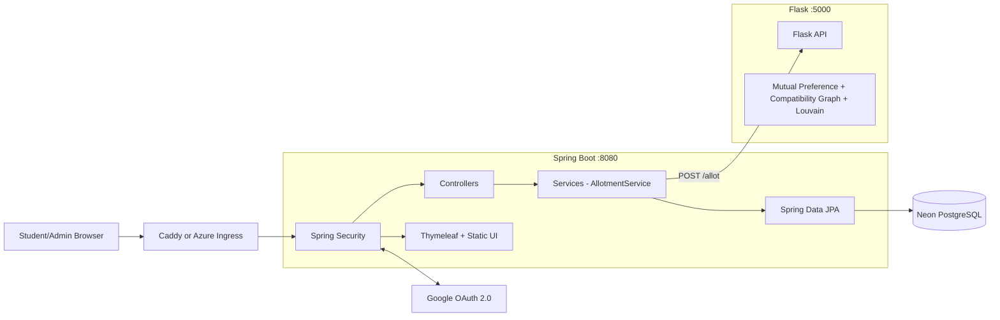
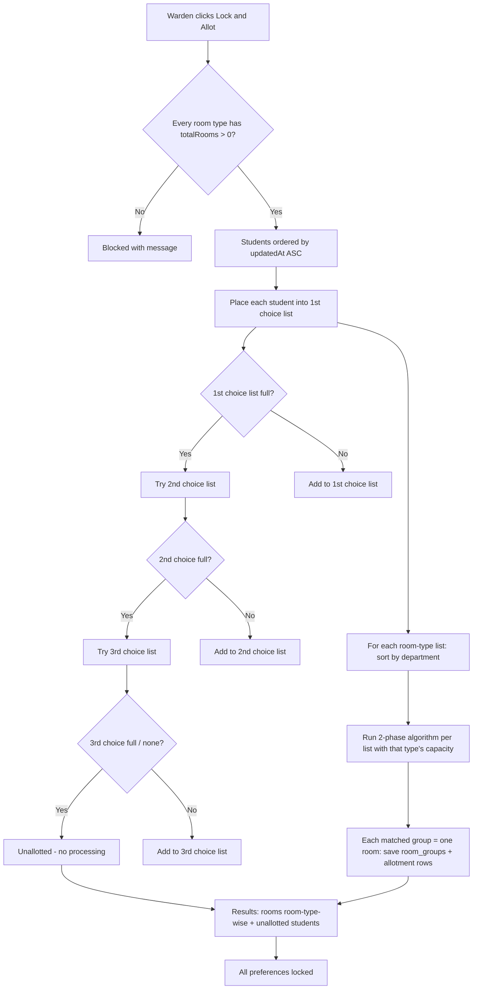
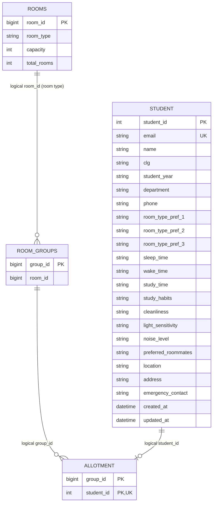

# StableRoomie

StableRoomie is a web-based hostel roommate recommendation and allotment system. Students authenticate with Google, submit lifestyle preferences and up to three room-type preferences, and view their final room and roommates. Administrators (the warden) configure room types with the total number of rooms available, then run a single **Lock & Allot** step that finalizes the allotment for every student and locks all preference changes.

The application uses a Spring Boot web application as its main entry point, a Flask microservice for the two-phase graph-based roommate matching, and Neon serverless PostgreSQL for persistence (a local PostgreSQL 14 also works).

## Table of Contents

- [1. Problem Statement](#1-problem-statement)
- [2. Features and Actors](#2-features-and-actors)
- [3. Technology Stack](#3-technology-stack)
- [4. Repository Structure](#4-repository-structure)
- [5. System Architecture](#5-system-architecture)
- [6. Complete Application Flow](#6-complete-application-flow)
- [7. Allotment Algorithm](#7-allotment-algorithm)
- [8. Database Design](#8-database-design)
- [9. API Reference](#9-api-reference)
- [10. Authentication and Authorization](#10-authentication-and-authorization)
- [11. Frontend Working](#11-frontend-working)
- [12. Configuration](#12-configuration)
- [13. Running Locally](#13-running-locally)
- [14. Error Handling and Edge Cases](#14-error-handling-and-edge-cases)
- [15. Known Issues and Technical Debt](#15-known-issues-and-technical-debt)
- [16. Improvement Roadmap](#16-improvement-roadmap)
- [17. Source Map](#17-source-map)

## 1. Problem Statement

Manual hostel-room allocation does not naturally account for lifestyle compatibility. StableRoomie collects preferences such as sleeping time, waking time, cleanliness, study habits, noise tolerance, light sensitivity, location, preferred roommates, and room-sharing type. Students also rank up to three room-type choices. The warden enters the total number of rooms available for every room type and then clicks **Lock and Allot**; the application places every student into their preferred room type (falling back to 2nd/3rd choice as capacity fills) and uses mutual preferences plus Louvain community detection to form roommate groups within each room type.

### Core goals

1. Authenticate students and administrators using Google OAuth 2.0.
2. Collect one preference profile per OAuth email, including up to three room-type preferences.
3. Track when each preference profile was created and last updated.
4. Let the warden configure room types with capacity (students per room) and total room count.
5. Run the entire allotment in a single "Lock and Allot" stretch that also locks all preference changes.
6. Prioritize students by their preference update time when filling room types.
7. Group each room-type list by department and then with the two-phase matching algorithm.
8. Report students who fit into no room type as unallotted (no allotment entry for them).
9. Let students view their assigned room and roommate contact information.
10. Let administrators inspect students, per-room-type allotments, unallotted students, and export a final PDF.

## 2. Features and Actors

### Student

- Google sign-in.
- Preference profile creation and update (up to three room-type preferences) — only while the warden's preference-selection window is open.
- Profile prefill on later visits.
- Created/updated timestamps shown on the dashboard and form.
- Preference locking after the warden runs Lock & Allot.
- Current allotment status: room type, room number, roommates.

### Administrator (warden)

- Separate admin dashboard granted to the single admin email configured via `app.admin.email` (env `ADMIN_EMAIL`).
- Open/close the **preference-selection window** that gates whether students can submit or edit preferences.
- Room-type management: name, students per room (`capacity`), total rooms available (`totalRooms`).
- Overview statistics: allotted and unallotted students.
- Rooms allotted shown room-type-wise.
- Student preference search and inspection with created/updated timestamps.
- **Lock & Allot**: a single action that finalizes allotment for everyone and locks preferences.
- Reset Allotment: clears groups/allotments for a re-run; the preference window stays closed until the warden manually reopens it.
- **Flush All Data**: full wipe back to the fresh state — deletes all students (and their preferences), room types, groups and allotments, and closes the preference window; guarded by a warning dialog.
- Client-side PDF export using jsPDF and AutoTable containing: rooms allotted room-type-wise, the flat allotted-students list, and the unallotted students list.

### Internal Flask service

- Health endpoints.
- `POST /allot`: runs the two-phase matching (mutual preferences, then Louvain) on one room-type list sent inline by Spring Boot.
- No callbacks into Java — Spring Boot performs preference grouping and persistence itself.

## 3. Technology Stack

| Area | Technology | Repository evidence |
|---|---|---|
| Main backend | Java 17, Spring Boot 3.5.0 | [`pom.xml`](StableRoomie/pom.xml) |
| Web/API | Spring MVC | `spring-boot-starter-web` |
| Persistence | Spring Data JPA, Hibernate | `spring-boot-starter-data-jpa` |
| Security | Spring Security, OAuth2 Client | `spring-boot-starter-security`, `spring-boot-starter-oauth2-client` |
| Server-rendered view | Thymeleaf | `spring-boot-starter-thymeleaf` |
| Frontend | HTML, CSS, vanilla JavaScript | [`index.html`](StableRoomie/src/main/resources/templates/index.html), [`allotment.js`](StableRoomie/src/main/resources/static/scripts/allotment.js) |
| Matching service | Python 3.10 image, Flask 3.1.1 | [`flask-api/Dockerfile`](flask-api/Dockerfile), [`requirements.txt`](flask-api/requirements.txt) |
| Graph processing | NetworkX 3.2.1, python-louvain 0.16 | [`allot.py`](flask-api/service/allot.py) |
| HTTP between services | Spring `RestTemplate`, Python `requests` | Java `AllotmentService` and Flask app |
| Development DB | Neon serverless PostgreSQL (pooler endpoint) — required, no H2 fallback | [`application.properties`](StableRoomie/src/main/resources/application.properties) |
| Container DB | None — the Compose stack connects directly to Neon serverless PostgreSQL | [`docker-compose.yml`](docker-compose.yml) |
| Packaging | Maven, JAR, Gunicorn | Java and Flask Dockerfiles |
| Local reverse proxy | Caddy 2 | [`Caddyfile`](Caddyfile) |
| Cloud target | Azure Container Apps and Azure Container Registry | [`deploy/deploy-azure.sh`](deploy/deploy-azure.sh) |

## 4. Repository Structure

```text
StableRoomie/
├── readme.md                         # This complete project guide
├── docker-compose.yml                # Java, Flask, Caddy (DB: Neon serverless)
├── Caddyfile                         # Reverse proxy to Java backend
├── AZURE_DEPLOYMENT.md               # Azure command guide
├── DEPLOYMENT_SUMMARY.md             # Recorded deployment summary
├── RUNNING.md                        # Older local-running notes
├── deploy/
│   ├── deploy-azure.sh               # Build/push/deploy automation
│   ├── check-activity.sh             # Container activity helper
│   └── azure-cost-manager.sh         # Scale/status helpers
├── StableRoomie/                     # Spring Boot application
│   ├── pom.xml
│   ├── Dockerfile
│   ├── Dockerfile.deploy
│   └── src/
│       ├── main/
│       │   ├── java/in/edu/ssn/hostel/
│       │   │   ├── HostelAllotmentApplication.java
│       │   │   ├── config/               # Spring Security
│       │   │   ├── controller/           # MVC and REST entry points
│   │   │   ├── service/              # Business logic (incl. AllotmentService)
│       │   │   ├── repo/                 # JPA repositories
│       │   │   └── model/                # Entities
│       │   └── resources/
│       │       ├── application.properties
│       │       ├── import.sql
│       │       ├── templates/index.html  # Single-page login/admin/student UI
│       │       └── static/               # CSS, JavaScript, image
│       └── test/java/in/edu/ssn/hostel/
│           └── service/AllotmentServiceTest.java
└── flask-api/
    ├── app.py                        # Flask application
    ├── requirements.txt
    ├── Dockerfile
    ├── Dockerfile.deploy
    └── service/allot.py              # Two-phase matching algorithm
```

Generated directories such as `target/`, Python virtual environments, and runtime logs are not application source.

## 5. System Architecture

### 5.1 Component architecture



### 5.2 Network and port map

| Component | Local/container port | Responsibility |
|---|---|---:|
| Caddy | 80, 443 | TLS termination and reverse proxy in Docker Compose |
| Spring Boot | 8080 | UI, OAuth session, REST APIs, persistence orchestration |
| Flask/Gunicorn | 5000 | Two-phase matching engine |

There is no database container — the Compose stack's Java service connects to Neon serverless PostgreSQL using `DB_*` values from the root `.env`.

The browser communicates only with Spring Boot. Spring Boot calls Flask synchronously during Lock & Allot, one call per non-empty room-type list. Flask never calls back into Java.

### 5.3 Why two backend services?

Spring Boot owns identity, HTTP sessions, UI delivery, validation/orchestration, and relational persistence. Flask isolates the graph algorithm and Python graph libraries (NetworkX, python-louvain).

## 6. Complete Application Flow

### 6.1 Google login and role routing

1. The user opens `/` and clicks "Continue with Google".
2. Spring Security runs the OAuth2 authorization-code flow.
3. `CustomOAuth2UserService` adds a `role` attribute (`ADMIN` for the single admin email from `app.admin.email`, `STUDENT` otherwise).
4. `/process` redirects by role to `/admin/dashboard` or `/student/dashboard`.
5. The frontend calls `/api/user-info` and shows the matching dashboard sections.

### 6.2 Student preference submission

1. The warden opens the **preference-selection window** (Lock & Allot screen → "Open Preference Selection"). Until then, `/saveStudents` rejects every submission and the student form is disabled with a "not opened yet" banner.
2. The student fills the preference form: name, student ID (digital ID), college, department, year, contact details, lifestyle preferences, location, preferred roommates (by digital ID), and **1st/2nd/3rd room-type preferences**.
3. `allotment.js` sends `POST /saveStudents` (no client-side timestamp — the server sets `createdAt`/`updatedAt`).
4. `StudentController` overwrites the email with the authenticated OAuth email.
5. Submissions are gated by the preference window only: if the window is closed, HTTP 400 is returned with the not-opened message. (Finalizing the allotment auto-closes the window, so a finalized allotment is effectively read-only until the warden reopens it.)
6. Otherwise the student row is inserted/updated; `updatedAt` is refreshed on every edit, which is exactly what determines allotment priority.

### 6.3 Warden setup

1. **Open the preference window** (Lock & Allot screen) so students can submit; close it once collection is done (finalizing via **Lock & Allot** closes it automatically).
2. Under **Room Types** the warden adds room types: name (e.g. `3-Sharing`), students per room (`capacity`), and **total rooms available** (`totalRooms`).
3. The Lock & Allot screen shows a configuration summary (room type, students/room, total rooms, total capacity = `totalRooms × capacity`).
4. The **Lock and Allot** button stays disabled until every room type has both students-per-room (`capacity`) and total rooms (`totalRooms`) entered.

### 6.4 Lock & Allot (the single-stretch allotment)



Details:

1. **Validation** — `AllotmentService.lockAndAllot()` refuses to run if allotment already exists or if any room type is missing a valid `capacity` (students per room) or `totalRooms`.
2. **Preference grouping** — Students are loaded ordered by `updatedAt` ascending (earliest preference fill/update first). Each student is placed into the list of their 1st-choice room type; if that list has reached `totalRooms × capacity` students, the 2nd choice is tried, then the 3rd. A student therefore lands in at most one room-type list.
3. **Unallotted** — Students who fit into no list are reported as unallotted. No algorithm runs on them and no `allotment` row is created; they only appear in the results/PDF.
4. **Two-phase matching per list** — Each non-empty room-type list is sorted by department (so same-department students are grouped together) and then sent to Flask (`POST /allot`, capacity = that type's students per room). Flask runs Pass 1 (fully mutual preferred-roommate groups) and Pass 2 (weighted compatibility graph + Louvain community detection, leftovers chunked).
5. **Persistence** — Each matched group becomes one `room_groups` row (`room_id` = the room type) plus one `allotment` row per member. The number of groups per type never exceeds `totalRooms` because the list size is capped at `totalRooms × capacity`.
6. **Locking** — Finalizing closes the preference window, so every future preference edit is rejected while it stays closed; the student UI disables the form and explains why (lock banner).

### 6.5 Student allotment lookup

1. `GET /api/student/allotment` finds the student by OAuth email.
2. The `allotment` table gives the student's `groupId`; the `room_groups` row gives the `roomId` (room type).
3. Sibling allotments with the same `groupId` are resolved to roommate profiles.
4. The response also carries `locked` so the UI can disable the form even for unallotted students after Lock & Allot.

## 7. Allotment Algorithm

### 7.1 Inputs and outputs

**Input:** one room-type list of student JSON objects and a room capacity.

**Output:** a list of groups, where each group is a list of student IDs.

### 7.2 Compatibility score

For every pair of unassigned students, the algorithm adds these contributions:

| Factor | Rule | Maximum contribution |
|---|---|---:|
| Sleep time | Linear decrease to zero across a two-hour difference | 0.4 |
| Wake time | Linear decrease to zero across a two-hour difference | 0.4 |
| Noise level | Exact match | 0.3 |
| Light sensitivity | Exact match | 0.3 |
| Cleanliness | Exact match: 0.3; either `moderately-clean`: 0.2 | 0.3 |
| Study habit | Exact match: 0.3; predefined mixed pairs: 0.0-0.2 | 0.3 |
| Preferred roommate | Mutual: 1.0; one-way: 0.5 | 1.0 |
| **Maximum implemented pair score** | All maximum rules satisfied | **3.0** |

Sleep times after midnight are linearized (`12:00 AM` → 24, `1:00 AM` → 25, ...). Invalid sleep/wake values default to 10 PM / 7 AM. Preferred roommates are stored as comma-separated **digital IDs** (the student IDs entered on the preference form), so resolution is exact — there is no name-ambiguity problem. Non-numeric tokens and IDs that do not exist are ignored.

### 7.3 Two-phase grouping

**Pass 1 — fully mutual requested groups (full groups only):** for each unassigned student who lists at least `C - 1` preferred roommates (as digital IDs), combinations of `C - 1` of those IDs are checked; the first combination where every member lists every other member is accepted as a group of **exactly** `C` students. Pass 1 never creates a smaller group: two students who mutually prefer each other but list no third roommate do **not** form a pair-group — each needs `C - 1` (= 2, for a 3-sharing room) mutual preferences. Such pairs simply stay in the pool; Pass 2 keeps them together because their mutual-preference edge scores 1.0.

**Pass 2 — Louvain communities:** all remaining students become nodes of a weighted graph (edges only when compatibility > 0); `community_louvain.best_partition()` finds communities; each community is chunked into groups of `C`; each community's remainder (1 to `C - 1` students) joins a shared leftover pool.

**Final — one partial group:** the leftover pool (all community remainders combined) is chunked into groups of `C`. Because it is a single list, this yields **exactly one final group** of size `n mod C` (1 to `C - 1`) — the only partial group in the list. Examples with capacity 3: 8 students → `3 + 3 + 2`; 7 students → `3 + 3 + 1`.

Because Spring Boot sorts each list by department before calling Flask, same-department students are adjacent and therefore tend to land in the same chunks/rooms, satisfying "same department students will get allotted together".

### 7.4 Group size and room-count rules

- **Every group is one room.** A full group, a 2-member group, or a lone 1-member group each creates one `room_groups` row and consumes one room from that type's `totalRooms`.
- **Groups per list = `ceil(n / C)` exactly** (verified against the implementation, including the mutual-pair scenario above). Because Spring caps each list at `totalRooms × capacity`, `usedRooms` for a type can never exceed the warden's configured `totalRooms`.
- **Partial rooms are normal:** 8 students in a 3-sharing type use 3 rooms with one bed empty; 7 students use 3 rooms with one student alone. The warden's room count is the hard ceiling — not the bed count.
- **Overflow creates rooms in other types:** students who do not fit into their 1st-choice list (it reached `totalRooms × capacity`) spill into their 2nd/3rd choice types, and every spill group — even a single student — consumes a room in that other type. So when more students want a type than its capacity allows, the results can show more total rooms than the warden planned for one type alone.

## 8. Database Design

### 8.1 Persistence behavior

- Hibernate manages schema creation/update with `ddl-auto=update`.
- There is no Flyway or Liquibase migration history.
- Every environment connects to Neon serverless PostgreSQL (pooler endpoint) through the `DB_*` env vars — there is no H2 fallback. The integration test suite runs against a separate disposable Neon database (`stableromie_test`, via `TEST_DB_URL`), see §13.6.
- No seed data is shipped or auto-executed — the application starts with empty tables.
- `import.sql` contains no executable seed data.

### 8.2 Entity relationship diagram

The arrows below represent logical ID references in application code. The entities do **not** declare JPA relationships or database foreign-key annotations.



### 8.3 Table definitions

#### `student`

| Column | Java type | Constraint/meaning |
|---|---|---|
| `student_id` | `int` | Primary key; supplied by client, not generated |
| `email` | `String` | Unique; replaced by authenticated OAuth email on save |
| `name` | `String` | Student name |
| `clg` | `String` | College display value |
| `student_year` | `String` | Academic year |
| `department` | `String` | Department code |
| `phone` | `String` | Contact number |
| `room_type_pref_1` | `String` | First-choice room type (required for priority grouping) |
| `room_type_pref_2` | `String` | Second-choice room type (optional) |
| `room_type_pref_3` | `String` | Third-choice room type (optional) |
| `sleep_time` | `String` | Lifestyle input used by matcher |
| `wake_time` | `String` | Lifestyle input used by matcher |
| `study_time` | `String` | Stored preference; not used in the compatibility score |
| `study_habits` | `String` | Used by matcher |
| `cleanliness` | `String` | Used by matcher |
| `light_sensitivity` | `String` | Used by matcher |
| `noise_level` | `String` | Used by matcher |
| `preferred_roommates` | `String` | Comma-separated digital IDs (student IDs) of preferred roommates |
| `location` | `String` | Chennai/non-Chennai value |
| `address` | `String` | Student address |
| `emergency_contact` | `String` | Emergency phone/contact |
| `created_at` | `LocalDateTime` | Set by Hibernate on insert |
| `updated_at` | `LocalDateTime` | Set by Hibernate on every update; drives allotment priority |

#### `rooms`

| Column | Java type | Constraint/meaning |
|---|---|---|
| `room_id` | `Long` | Identity primary key |
| `room_type` | `String` | Display name such as `3-Sharing` |
| `capacity` | `Integer` | Students per room for this type |
| `total_rooms` | `Integer` | Total number of rooms available of this type; required before Lock & Allot |

#### `room_groups`

| Column | Java type | Constraint/meaning |
|---|---|---|
| `group_id` | `Long` | Identity primary key; one row per occupied room |
| `room_id` | `Long` | Logical reference to the rooms row = the room **type** |

The physical table is named `room_groups` because `groups` is a reserved SQL keyword in PostgreSQL.

#### `allotment`

| Column | Java type | Constraint/meaning |
|---|---|---|
| `group_id` | `Long` | Part of the composite primary key; logical reference to a room_groups row (room) |
| `student_id` | `Integer` | Part of the composite primary key; logical reference to a student; UNIQUE across the table (one active allotment per student) |

#### `settings`

| Column | Java type | Constraint/meaning |
|---|---|---|
| `setting_id` | `Long` | Fixed primary key `1` (single row) |
| `preferences_open` | `boolean` | Preference-selection window state; gates student submissions (defaults closed) |

### 8.4 Default data

There is no default/seed data. All tables start empty: the warden adds room
types under **Room Types**, and students register themselves via Google login.
Department is a free-text field on the student form (no category table).

### 8.5 Removed tables

- `category` (and its controller/service/repo) — removed; departments come from student profiles.
- `allotment_runs` — removed; the allotment is finalized in one stretch, so per-run history is unnecessary.
- `student_groups` (student_1..4 columns) — replaced by `room_groups` + `allotment`.

### 8.6 Data-integrity implications

Because group references are plain numeric columns with no JPA foreign keys:

- The database does not prevent a nonexistent student/room reference.
- Deleting a room can leave group rows referring to the removed room (room mutations are blocked while the allotment is locked).
- The UNIQUE constraint on `allotment.student_id` does guarantee one active allotment per student.

## 9. API Reference

### 9.1 Authentication legend

- **Public:** permitted by the current Spring Security configuration.
- **Authenticated:** any logged-in Google user; current API security does not enforce the admin role.
- **Manual role check:** controller checks the OAuth `role` attribute.

### 9.2 Page, session, and identity endpoints

| Method | Path | Access | Purpose |
|---|---|---|---|
| `GET` | `/` | Public | Renders `index.html` |
| `GET` | `/login` | Public | Renders `index.html` |
| `GET` | `/error` | Public | Redirects to `/login?error=oauth` |
| Any | `/process` | Authenticated | Redirects by role |
| `GET` | `/api/user-info` | Public | Authentication state and user attributes |
| `GET` | `/logout` | Authenticated | Invalidates session and redirects `/` |
| `GET` | `/admin/dashboard` | Manual ADMIN check | Renders `index.html` |
| `GET` | `/student/dashboard` | Manual STUDENT check | Renders `index.html` |

### 9.3 Student endpoints

| Method | Path | Access | Purpose |
|---|---|---|---|
| `POST` | `/saveStudents` | Authenticated | Insert/update preference profile (rejected while the preference window is closed) |
| `GET` | `/api/student/profile` | Authenticated | Find profile by OAuth email |
| `GET` | `/api/student/allotment` | Authenticated | Current student's room, roommates, and lock state |
| `GET` | `/api/admin/students` | Authenticated | Return all student entities |
| `GET` | `/api/admin/allotment-stats` | Authenticated | Allotted/unallotted counts and lists |

#### `POST /saveStudents`

Request shape:

```json
{
  "studentId": 1234,
  "name": "Student Name",
  "clg": "SSN College",
  "year": "2nd",
  "department": "IT",
  "phone": "9000000000",
  "roomTypePref1": "3-Sharing",
  "roomTypePref2": "2-Sharing",
  "roomTypePref3": "4-Sharing",
  "sleepTime": "11:00 PM",
  "wakeTime": "7:00 AM",
  "studyTime": "Evening",
  "studyHabits": "silent",
  "cleanliness": "moderately-clean",
  "lightSensitivity": "No",
  "noiseLevel": "Low",
  "preferredRoommates": "1002, 1003",
  "location": "chennai",
  "address": "Address",
  "emergencyContact": "9000000001"
}
```

The server ignores any request email and uses the OAuth principal email. `createdAt`/`updatedAt` are set server-side. Rejections return HTTP 400:

```json
{
  "message": "Preference selection has not been opened yet by the warden. Please check back later."
}
```

#### `GET /api/student/allotment`

Not yet grouped:

```json
{
  "allotted": false,
  "locked": false,
  "preferencesOpen": true
}
```

Grouped response shape:

```json
{
  "allotted": true,
  "locked": true,
  "preferencesOpen": true,
  "roomId": 1,
  "groupId": 7,
  "roomType": "3-Sharing",
  "roommates": [
    {
      "name": "Roommate Name",
      "email": "roommate@ssn.edu.in",
      "phone": "9000000002",
      "department": "IT",
      "year": "2nd"
    }
  ]
}
```

### 9.4 Admin allotment endpoints

| Method | Path | Access | Purpose |
|---|---|---|---|
| `GET` | `/api/admin/preferences-window` | Authenticated | Current window state `{ "preferencesOpen": bool }` |
| `POST` | `/api/admin/preferences-window` | Authenticated | Body `{ "open": true/false }` — opens/closes the preference-selection window for all students |
| `POST` | `/api/admin/lock-and-allot` | Authenticated | Run the full single-stretch allotment; closes the preference window; returns results |
| `GET` | `/api/admin/allotment-results` | Authenticated | Rooms allotted room-type-wise + unallotted students (includes `preferencesOpen`) |
| `POST` | `/api/admin/reset-allotment` | Authenticated | Delete all groups/allotments (preference window stays as the warden left it) |
| `POST` | `/api/admin/flush-all-data` | Authenticated | Full wipe: delete all students, rooms, groups and allotments; preference window resets to closed |

#### `POST /api/admin/lock-and-allot`

Validation failures return HTTP 400, for example:

```json
{
  "message": "Warden must enter the total number of rooms available for room type: 3-Sharing"
}
```

Success returns the same shape as `GET /api/admin/allotment-results`.

#### `GET /api/admin/allotment-results`

```json
{
  "locked": true,
  "allottedCount": 116,
  "unallottedCount": 4,
  "roomTypes": [
    {
      "roomType": "3-Sharing",
      "capacity": 3,
      "totalRooms": 20,
      "usedRooms": 18,
      "rooms": [
        {
          "groupId": 7,
          "students": [
            { "studentId": 1000, "name": "Pooja Das", "department": "IT", "year": "2nd", "email": "...", "phone": "..." }
          ]
        }
      ]
    }
  ],
  "unallotted": [
    {
      "studentId": 1400,
      "name": "Some Student",
      "department": "CSE",
      "year": "2nd",
      "email": "...",
      "phone": "...",
      "preferences": ["3-Sharing", "2-Sharing", "4-Sharing"]
    }
  ]
}
```

### 9.5 Room endpoints

| Method | Path | Access | Purpose |
|---|---|---|---|
| `POST` | `/room-details` | Authenticated | `{ "name": "4-Sharing", "capacity": 4, "totalRooms": 10 }` |
| `POST` | `/update-room/{id}` | Authenticated | `{ "capacity": 4, "totalRooms": 15 }` (partial updates allowed) |
| `GET` | `/get-rooms` | Authenticated | Returns all rooms ordered by `roomId` |
| `DELETE` | `/remove-room/{id}` | Authenticated | Deletes one room type row |
| `DELETE` | `/remove-room-type/{roomType}` | Authenticated | Deletes every row of that type |

All room mutations return HTTP 400 while the allotment is locked.

### 9.6 Flask endpoints

| Method | Path | Purpose |
|---|---|---|
| `GET` | `/` | `{ "status": "ok" }` |
| `GET` | `/health` | `{ "status": "ok" }` |
| `POST` | `/allot` | Two-phase matching for one room-type list: body `{ "students": [...], "capacity": 3 }` → `{ "groups": [[1001,1002,1003], ...] }` |

Flask no longer calls Java (`/getStudents` and `/save-groups` were removed), which also eliminated the previous `student_map` crash bug in the success path.

## 10. Authentication and Authorization

- Google OAuth 2.0 supplies email and profile attributes.
- `CustomOAuth2UserService` adds a `role` attribute (`ADMIN` for the single admin email from `app.admin.email`, `STUDENT` otherwise); the granted Spring authority is always `ROLE_USER`.
- Explicitly public Spring paths: `/`, `/login`, `/api/user-info`, `/error`, `/favicon.ico`, `/styles.css`, `/scripts/**`, `/src/**`.
- Every other Spring path requires authentication, but admin APIs do not enforce an admin authority.
- CSRF is disabled globally; controller `@CrossOrigin` has no origin restriction; Flask enables unrestricted CORS.

For production, use role authorities, route authorization, CSRF protection, restricted CORS, service authentication, DTOs that omit private fields, and an enforced organization-domain policy.

## 11. Frontend Working

- One Thymeleaf template (`index.html`) serves login and both dashboards; JavaScript switches sections based on `/api/user-info`.
- Permanent **velvet dark theme**: a deep plum-navy palette with an indigo-violet accent (`color-scheme: dark`), so the whole app — including native select dropdowns and scrollbars — renders consistently dark.
- Student form: three room-type preference selects (1st required, 2nd/3rd optional, must differ), free-text department with a datalist, and a banner that disables the whole form while the preference window is closed (a lock banner explains the reason after finalization).
- Admin screens: **Room Types** (management table with inline students-per-room + total rooms editing, per-row Configured/Needs-rooms status badges, and a header showing "X of Y configured", total capacity, and a Ready for Lock & Allot badge), **Track Preferences** (search + created/updated columns), **Lock & Allot** (configuration summary, disabled-until-configured button, results, reset, Flush All Data danger button), **Overview** (stats + rooms allotted room-type-wise + unallotted).
- Destructive or final actions (Lock & Allot, Reset Allotment, Flush All Data, remove room type) use an in-app confirmation dialog — Lock & Allot shows a live summary (students with preferences, total capacity, expected unallotted). All feedback uses toast notifications instead of native `alert`/`confirm`.
- PDF export (`downloadPDF`) renders every room-type results block plus the flat allotted-students table and the unallotted students table via jsPDF/AutoTable; PDF text is sanitized (emoji/arrows stripped) so jsPDF's built-in fonts never render mojibake.

## 12. Configuration

### 12.1 Spring Boot environment variables

| Variable | Required | Default | Meaning |
|---|---|---|---|
| `GOOGLE_CLIENT_ID` | Yes for OAuth | None | Google OAuth client ID |
| `GOOGLE_CLIENT_SECRET` | Yes for OAuth | None | Google OAuth client secret |
| `DB_URL` | Yes | None — Neon pooler JDBC URL (see §13.2) | JDBC URL; the app fails fast without it |
| `DB_USERNAME` | Yes | None | Database user (`neondb_owner` for Neon) |
| `DB_PASSWORD` | Yes | None | Database password |
| `DB_DRIVER` | No | `org.postgresql.Driver` | JDBC driver |
| `DB_DIALECT` | No | `org.hibernate.dialect.PostgreSQLDialect` | Hibernate dialect |
| `TEST_DB_URL` | No (tests only) | None — `stableromie_test` Neon pooler URL | Test-suite database; its tables are wiped on every test run (see §13.6) |
| `FLASK_API_URL` | No | `http://127.0.0.1:5000` | Flask base URL |
| `ADMIN_EMAIL` | No | `mohit2310893@ssn.edu.in` | The single account that gets the ADMIN dashboard |

The shipped `StableRoomie/.env` also duplicates the database settings as `SPRING_DATASOURCE_URL`, `SPRING_DATASOURCE_USERNAME`, and `SPRING_DATASOURCE_PASSWORD`. Spring Boot's relaxed binding accepts either form (explicit environment variables override `application.properties`), and both are kept identical to avoid ambiguity.

### 12.2 Google OAuth redirect URI

For local development: `http://localhost:8080/login/oauth2/code/google`. For deployment, use the equivalent HTTPS callback. `redirect_uri_mismatch` errors mean that exact URI is not registered under the client's "Authorized redirect URIs" in Google Cloud Console.

### 12.3 dotenv files

The app uses spring-dotenv, which loads a `.env` file from the **working directory** (`StableRoomie/.env`) on top of real environment variables. The repository-root `.env` is only a reference copy and is not loaded when running from `StableRoomie/`. The `.env` in this project contains the local Google OAuth client, the Neon serverless PostgreSQL connection (pooler JDBC URL, `neondb_owner` credentials), driver, and dialect settings. Both `.env` files are gitignored so credentials never enter version control.

## 13. Running Locally

### 13.1 Prerequisites

- Java 17, Maven, Python 3, Google OAuth client credentials, and a Neon serverless database (the current setup; a local PostgreSQL 14 also works).

### 13.2 Option A: Spring Boot with Neon serverless and Flask (default)

Neon is required — the application has no built-in fallback database. Set the
`DB_*` variables (or rely on `StableRoomie/.env`, which ships with Neon values):

```bash
export DB_URL="jdbc:postgresql://<your-pooler-host>/neondb?sslmode=require&channelBinding=require"
export DB_USERNAME="neondb_owner"
export DB_PASSWORD="<neon-password>"
export DB_DRIVER="org.postgresql.Driver"
export DB_DIALECT="org.hibernate.dialect.PostgreSQLDialect"
```

`ddl-auto=update` creates the schema on first boot and tables start empty (no
seed data, see §8.4). Both `.env` files are gitignored, so credentials stay out
of version control.

Terminal 1:

```bash
cd StableRoomie
export GOOGLE_CLIENT_ID="your-client-id"
export GOOGLE_CLIENT_SECRET="your-client-secret"
export FLASK_API_URL="http://127.0.0.1:5000"
mvn spring-boot:run
```

Terminal 2:

```bash
cd flask-api
python3 -m venv venv
source venv/bin/activate
pip install -r requirements.txt
python3 app.py
```

> macOS note: AirPlay Receiver occupies port 5000 by default, which breaks
> Flask on that port. Either disable AirPlay Receiver in System Settings, or
> run Flask on another port and start Java with `FLASK_API_URL` pointing at
> it, e.g. `FLASK_API_URL=http://127.0.0.1:5001`.

Open `http://localhost:8080`. On a fresh Neon database the preference-selection
window defaults **closed** (open it under Lock & Allot → 📢 Preference Selection
Window before students can submit). The Docker Compose stack
(`docker compose up --build`) has **no local PostgreSQL container** —
`java-backend` interpolates the same `DB_*` and `GOOGLE_*` values from the root
`.env` and connects straight to Neon.

### 13.3 Option B: local PostgreSQL 14

Create the `stableromie` database, then start Java with the same `DB_*`
variables pointing at `localhost:5432` (`DB_DRIVER=org.postgresql.Driver`,
`DB_DIALECT=org.hibernate.dialect.PostgreSQLDialect`), plus the OAuth and Flask
variables.

### 13.4 No seed data

The application ships with no test/seed data — all tables start empty. The
warden adds room types under **Room Types**, and students register via Google
login and submit preferences while the preference window is open. To reset to
a clean slate, use **Reset Allotment** (clears results only) or **Flush All
Data** (deletes everything) in the UI, or truncate the tables in the
database.

### 13.5 Basic health checks

```bash
curl http://127.0.0.1:5000/health   # or :5001 when AirPlay Receiver holds port 5000 on macOS
curl http://localhost:8080/api/user-info
```

Expected unauthenticated Java response:

```json
{"authenticated":false}
```

### 13.6 Running tests

Tests run against Neon like the application itself — no in-memory database. They
use `TEST_DB_URL` (from `.env`), which must point at a **disposable** database:
every test wipes the `student`, `rooms`, `room_groups`, `allotment` tables.
Create the dedicated test database once (via the Neon console or psql), then:

```bash
psql "postgresql://neondb_owner:<NEON_PASSWORD>@<POOLER_HOST>/neondb?sslmode=require" -c "CREATE DATABASE stableromie_test;"
cd StableRoomie
mvn test
```

`AllotmentServiceTest` verifies the Lock & Allot pipeline end to end against
`stableromie_test` and a stub Flask endpoint on 127.0.0.1:5999: preference fill
by update time, department-sorted two-phase grouping, persistence into
`room_groups` + `allotment`, unallotted reporting, missing-`totalRooms`
rejection, double-run rejection, and reset-and-rerun. Never point `TEST_DB_URL`
at the dev/production database — the test suite deletes all rows in it.

## 14. Error Handling and Edge Cases

| Case | Current behavior |
|---|---|
| Lock & Allot with missing `totalRooms` on any type | HTTP 400 with the room type named |
| Lock & Allot with missing/invalid `capacity` on any type | HTTP 400 with the room type named |
| Lock & Allot with no students | HTTP 400 "No students have submitted their preferences yet." |
| Lock & Allot run twice | HTTP 400 "Allotment has already been finalized..." |
| Student edits preferences after Lock & Allot | HTTP 400 window-closed message (the window auto-closes on finalize); form disabled in UI |
| Student submits while the preference window is closed | HTTP 400 "not opened yet" message; form disabled in UI |
| Room mutation while locked | HTTP 400; warden must reset first |
| Student has fewer than 3 preferences | Remaining preference slots are skipped |
| Preferred room type not configured | That preference is skipped; next one tried |
| Student fits into no list | Reported as unallotted in results/PDF; no `allotment` row |
| Total capacity < total students | Overflow students remain unallotted |
| List size not divisible by capacity | Exactly one final partial room (e.g. 2 members in a 3-sharing room, or even 1); total rooms = `ceil(list size / capacity)`, still ≤ `totalRooms` |
| Flask unreachable | Lock & Allot fails with 500; transaction rolls back, nothing persisted |
| Flask response malformed | Lock & Allot fails with 500; nothing persisted |

## 15. Known Issues and Technical Debt

1. **Admin APIs lack role authorization** — any authenticated user can call admin endpoints directly.
2. **No foreign keys** — `room_groups.room_id` and `allotment.student_id` are plain numeric columns (the student_id UNIQUE constraint exists, but no FK integrity).
3. **`groups` is a reserved SQL keyword** — the physical table is named `room_groups`; entity class is `Groups`.
4. **OAuth domain is not enforced** — `ALLOWED_DOMAIN` is declared but never checked.
5. **Student ID is client-controlled** and acts as the primary key, allowing accidental overwrite of another row.
6. **CSRF disabled** while session cookies authenticate mutations; CORS unrestricted.
7. **Room deletion while groups exist** can orphan groups (mutations are blocked while locked, but resetting + deleting a used type can still orphan historical rows).
8. ~~Preferred-roommate names were ambiguous when duplicated~~ — **fixed:** `preferred_roommates` now stores digital IDs (student IDs), so resolution is exact (see §7.2).
9. **No database migrations** — Hibernate `ddl-auto=update` manages the schema; automated coverage is limited to the integration test for the allotment pipeline ([`AllotmentServiceTest`](StableRoomie/src/test/java/in/edu/ssn/hostel/service/AllotmentServiceTest.java)).
10. **MongoDB starter** is declared but auto-configuration is excluded and no MongoDB code is used.
11. **Secrets need operational review** — local environment files may contain credentials; keep only placeholders in version control.

## 16. Improvement Roadmap

### Phase 1: Correctness and integrity

1. Add `@Transactional` guarantees already present in `AllotmentService` to any future multi-write flows.
2. Add input validation for student IDs (capacity/totalRooms validation already exists in `AllotmentService` and the room endpoints).
3. Expand automated coverage beyond `AllotmentServiceTest` to controllers, security, room mutations, and PDF data.
4. Fix `year` serialization/rendering consistency (backend `year`, frontend uses `student.year`).

### Phase 2: Security

1. Convert the OAuth role attribute to real `ROLE_ADMIN`/`ROLE_STUDENT` authorities.
2. Apply route- and method-level role authorization.
3. Enforce the institutional email domain.
4. Enable CSRF protection and restrict CORS/Flask ingress.
5. Return privacy-minimized DTOs instead of full entities.

### Phase 3: Persistence

1. Add real foreign keys and useful indexes (`allotment.student_id`, `room_groups.room_id`).
2. Use Flyway or Liquibase migrations instead of `ddl-auto=update`.
3. Consider an explicit `allotment_status` flag if a re-run/partial-flow workflow is ever needed.

### Phase 4: Matching and scale

1. ~~Use student IDs instead of names for roommate preferences~~ — **done:** `preferredRoommates` stores digital IDs.
2. Optimize fixed-size grouping inside Louvain communities (currently naive chunking).
3. Add deterministic tie-breaking and reproducible seeds.
4. Run allotment asynchronously with retries/timeouts if lists grow large.

## 17. Source Map

| Topic | Primary source |
|---|---|
| Application entry | [`HostelAllotmentApplication.java`](StableRoomie/src/main/java/in/edu/ssn/hostel/HostelAllotmentApplication.java) |
| Security policy | [`SecurityConfig.java`](StableRoomie/src/main/java/in/edu/ssn/hostel/config/SecurityConfig.java) |
| OAuth role mapping | [`CustomOAuth2UserService.java`](StableRoomie/src/main/java/in/edu/ssn/hostel/service/CustomOAuth2UserService.java) |
| Login/dashboard routing | [`LoginController.java`](StableRoomie/src/main/java/in/edu/ssn/hostel/controller/LoginController.java), [`DashboardController.java`](StableRoomie/src/main/java/in/edu/ssn/hostel/controller/DashboardController.java) |
| Student APIs | [`StudentController.java`](StableRoomie/src/main/java/in/edu/ssn/hostel/controller/StudentController.java) |
| Lock & Allot / results / reset | [`AdminAllotmentController.java`](StableRoomie/src/main/java/in/edu/ssn/hostel/controller/AdminAllotmentController.java), [`AllotmentService.java`](StableRoomie/src/main/java/in/edu/ssn/hostel/service/AllotmentService.java) |
| Room management | [`roomsController.java`](StableRoomie/src/main/java/in/edu/ssn/hostel/controller/roomsController.java), [`roomService.java`](StableRoomie/src/main/java/in/edu/ssn/hostel/service/roomService.java) |
| Preference window / settings | [`SettingsService.java`](StableRoomie/src/main/java/in/edu/ssn/hostel/service/SettingsService.java), [`Settings.java`](StableRoomie/src/main/java/in/edu/ssn/hostel/model/Settings.java) |
| Entities | [`model/`](StableRoomie/src/main/java/in/edu/ssn/hostel/model/) |
| Flask two-phase endpoint | [`flask-api/app.py`](flask-api/app.py) |
| Matching algorithm | [`flask-api/service/allot.py`](flask-api/service/allot.py) |
| Frontend | [`index.html`](StableRoomie/src/main/resources/templates/index.html), [`allotment.js`](StableRoomie/src/main/resources/static/scripts/allotment.js), [`styles.css`](StableRoomie/src/main/resources/static/styles.css) |
| Runtime configuration | [`application.properties`](StableRoomie/src/main/resources/application.properties), [`docker-compose.yml`](docker-compose.yml) |
| Container builds | [`StableRoomie/Dockerfile`](StableRoomie/Dockerfile), [`flask-api/Dockerfile`](flask-api/Dockerfile) |
| Deployment automation | [`deploy/deploy-azure.sh`](deploy/deploy-azure.sh) |

---

StableRoomie is a useful prototype for discussing full-stack development, OAuth, Java/Python service integration, graph algorithms, relational modeling, containers, cloud deployment, and production-hardening decisions. The clearest interview presentation distinguishes the implemented behavior from the roadmap and explains how each identified limitation would be corrected.
